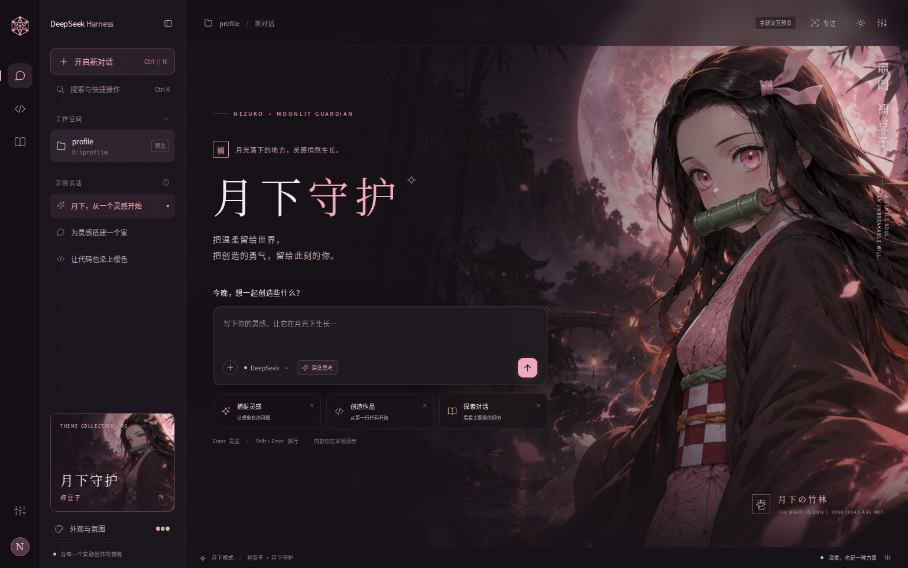
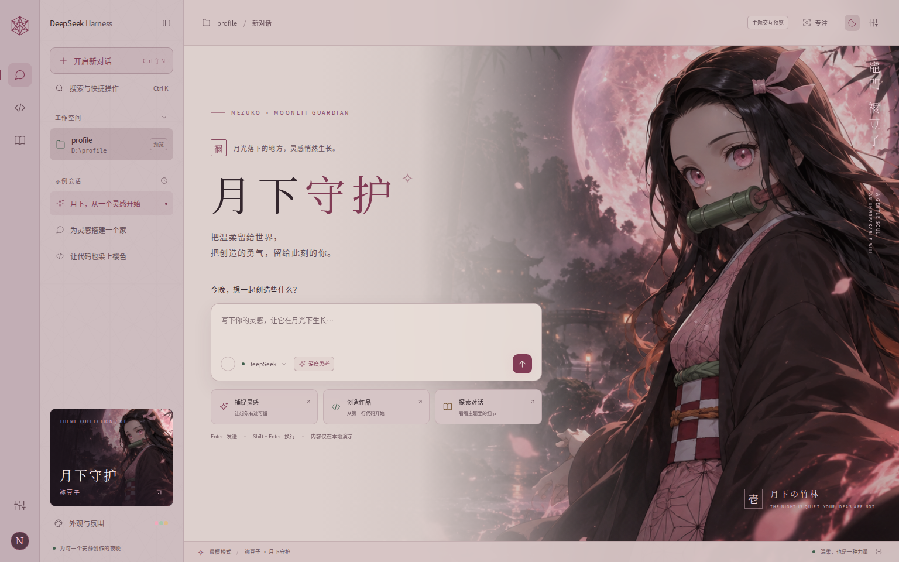

# 祢豆子 · 月下守护

NEZUKO · MOONLIT GUARDIAN — DeepSeek Harness 网页版主题皮肤

粉色麻叶纹、竹筒青、羽织深棕与柔和的月光。为安静创作的夜晚，留一份温柔与勇气。

**月下 · 深色模式**



**晨樱 · 暖灰樱色模式（v1.0.1）**



完整主题包含可离线打开的单 HTML 预览、已构建的 DSH 插件、全部源码、原始插画、字体许可和验证记录。

## v1.0.1 晨樱优化

晨樱改为暖灰樱色底，降低背景与输入框的亮度；收窄浅色遮罩，保留右侧人物的明暗与色彩。文字、按钮和边框同步加深。预览、DSH 插件与备用 CSS 均已更新。

## 先看效果

双击 `Nezuko-Preview.html`，即可在浏览器中打开完整交互预览。所有插画、字体、样式和脚本均已内嵌，打开后不需要联网，也不需要启动服务器。

可体验：月下 / 晨樱切换、插画强度、动态花瓣、专注模式、对话样式、代码样式、主题手册、附件名称展示、快捷搜索、手机布局。

预览中的消息为本地演示，不会调用模型。它展示主题的设计语言；实际 DSH 的界面结构、控件位置和首页文案仍由 DSH 版本及其他插件决定。

## 安装到你的 DSH

1. 把完整主题文件夹解压到固定位置，例如 `D:\Nezuko-Theme`。该文件夹应直接包含 `package.json`、`cordis.patch.yml` 和 `lib`。
2. 在这个文件夹打开 PowerShell。
3. 执行下面的命令。这里的 `web` 是示例 profile 名称；请替换为你实际启动 DSH 时使用的 profile。

```powershell
npx.cmd @deepseek-ai/dsh plugin --profile web add .
```

4. 用原来的命令重启 DSH，并刷新其网页地址，例如 `http://127.0.0.1:3080`；具体地址以 DSH 启动时的输出为准。
5. 点击界面右下角的 **「禰」** 按钮，选择「月下」或「晨樱」，调整插画强度、花瓣与专注模式。

包内已包含构建后的插件，不需要先运行 `npm install` 或编译命令。以上使用 `npx.cmd`，便于直接在 Windows PowerShell 中运行。

不要安装到一个临时解压后就会删除的位置。若你的环境已有其他主题插件，先在其自身设置中停用，再启用本主题，避免多个配色层互相覆盖。

## 使用边界

- 原生插件使用 DSH 的 `ctx.theme.overrideTokens`，为侧栏、输入区、消息气泡、链接、代码表面、滚动条、状态色和弹窗提供成对的昼夜配色。
- 插画样式使用公开源码中可见的 `data-phase`、`data-conversation-scroll` 标记。版本变动或替代界面插件可能影响插画显示；核心配色依靠 Theme API。
- 预览采用更完整的主题展示布局。安装插件不会替换 DSH 的会话逻辑、模型连接或原有工作区。
- 插件经源代码接口核对和模拟宿主的启停验证，**尚未在真实 DSH 环境中完成安装验证**。不保证所有历史版本或第三方界面插件拥有相同效果。
- 插画默认强度为 35%，保证实际对话区的可读性；演示首页默认使用 85% 强度展示设计。可自行调整。
- 主题不读取对话、项目文件、账户信息或凭据，也不向外部发送数据。插件自身只保存外观偏好；模型服务与 DSH 的原有行为照常由你自己的配置控制。
- 外观面板的「启用主题」开关可以立即恢复原配色。插件卸载时清理自己的样式、控件和装饰；用户手动选择的 DSH 昼夜模式不会被强制改回。

## CSS 备用文件

如果你已经在 DSH 页面使用支持「自定义 CSS」的主题工具，可以导入 `Nezuko-Standalone.css`。只将其作用域设置为你的 DSH 页面。该文件提供配色与麻叶几何纹样；完整人物插画、设置面板和动态花瓣由原生插件提供。

不同 CSS 工具的导入方式不同，包内没有假设 DSH 自带某个“导入 CSS”按钮。撤销时删除该自定义样式即可。不要同时启用原生插件与备用 CSS。

`theme.tokens.json` 是完整设计令牌文件，供继续开发和移植使用，不是 DSH 内置的主题导入格式。

## 文件说明

| 文件 | 用途 |
| --- | --- |
| `Nezuko-Preview.html` | 单 HTML 交互预览，可离线打开 |
| `lib/client.js`、`lib/index.js` | 已构建的 DSH 插件 |
| `package.json`、`cordis.patch.yml` | 插件入口与注册信息 |
| `Nezuko-Standalone.css` | 自定义 CSS 工具用的备用皮肤 |
| `theme.tokens.json` | 深浅配色和原生主题令牌 |
| `assets/nezuko-moonlight.png` | 原始祢豆子主题插画 |
| `assets/Moonlight*-Subset.woff` | 从 Noto CJK 提取的预览字符字体子集 |
| `preview/` | 未合并的预览 HTML、CSS 和 JavaScript |
| `src/` | 主题令牌、原生样式和插件源码 |
| `scripts/build.mjs` | 使用 Node.js 重建成品，无第三方构建依赖 |
| `qa/` | 预览截图、验证记录与接口模拟页面 |

## 修改与重新构建

修改 `src/` 或 `preview/` 内的文件后，在根目录执行：

```powershell
node scripts/build.mjs
```

构建会生成或更新单 HTML、原生插件、备用 CSS 和主题令牌。主题字体仅包含预览所需的字符；新增字符自动使用系统中文字体。正文和用户输入仍支持任意中文。

`scripts/check.mjs` 是交付前的浏览器验证脚本，需要 Playwright 及 Chromium，并使用运行环境中的 `CODEX_PRIMARY_RUNTIME_NODE_MODULES`。用户使用主题无需运行它。`qa/validation.json` 记录 v1.0.0 的基础验证范围，`qa/daylight-review.json` 记录 v1.0.1 的晨樱优化验证；这些记录不代表真实 DSH 环境中的实装结果。

## 接口与字体来源

接口核对日期：2026-09-12。

- [DSH 官方项目与启动说明](https://github.com/deepseek-ai/deepseek-harness)
- [官方 Theme API 与令牌说明](https://github.com/deepseek-ai/deepseek-harness/blob/master/packages/client/ui-theme/README.md)
- [官方 ThemeRuntime 实现](https://github.com/deepseek-ai/deepseek-harness/blob/master/packages/client/ui-theme/src/client/index.ts)
- [官方对话容器及数据标记](https://github.com/deepseek-ai/deepseek-harness/blob/master/packages/client/ui-conversation/src/client/skeleton/ConversationRoot.tsx)
- [社区 dsh-theme 插件：包入口、加载器与注册格式参考](https://github.com/oil-oil/dsh-theme)
- [Noto CJK 字体项目](https://github.com/notofonts/noto-cjk)

原创主题代码、生成插画及第三方字体说明见 `LICENSE-NOTICE.md`。
